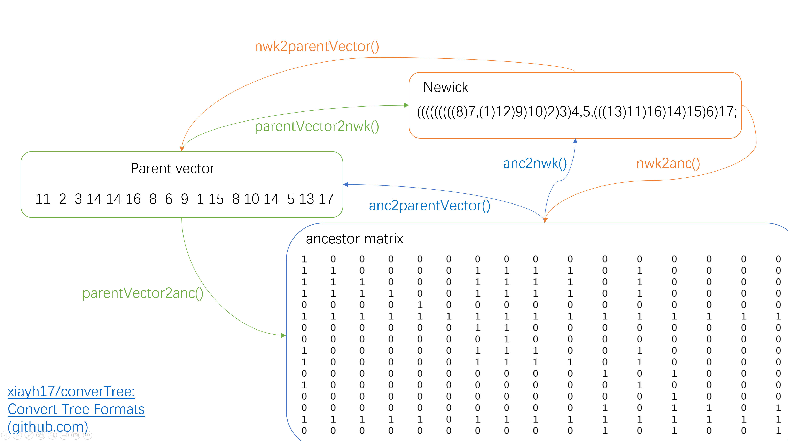

<!-- README.md is generated from README.Rmd. Please edit that file -->

```{r, include = FALSE}
knitr::opts_chunk$set(
  collapse = TRUE,
  comment = "#>",
  fig.path = "man/figures/README-",
  out.width = "100%"
)
```

# converTree

<!-- badges: start -->

<!-- badges: end -->

The goal of converTree is to convert tree format among newick, parent vector and ancestor matrix.

## Installation

You can install the development version of converTree like so:

```{r install, eval=FALSE}
devtools::install_github("xiayh17/converTree")
```

## Example

This is a basic example which shows you how to solve a common problem:

```{r example, eval=FALSE}
library(converTree)
## basic example code
```

## 1. Convert tree format

Functions of these module using Rcpp that convert tree format is a interface of R for code from <https://github.com/cbg-ethz/infSCITE>. Convert tree format among newick, parent vector and ancestor matrix. convert like so:

```{r test, eval=FALSE}
## parent vector > child list > nwk
p = c(11, 2, 3, 14, 14, 16, 8, 6, 9, 1, 15, 8, 10, 14, 5, 13, 17)
cl = getChildListFromParentVector(p,16)
childList2nwk(list = cl,n = 16)
## parent vector > nwk
parentVector2nwk(parents=p,n = 16)
## parent vector > anc
parentVector2anc(parents=p,n = 16)
## anc > parent vector
anc <- parentVector2anc(parents=p,n = 16)
anc2parentVector(anc=anc,n=16)
## anc > nwk
anc2nwk(anc=anc,n=16)
## nwk > parent vector
nwk2parentVector(nwk,n=16)
## nwk > anc
nwk2anc(nwk)
```



## 2. Stack mutation tree

Stack mutations in branch and set branch length to number of mutations.

-   Here is a normal mutation tree

```{r}
suppressMessages(library(ggtree))
library(converTree)
nwk_text = "((((((((((8)7,(1)12)9)10)2)4)3,5,(((17)11)16)14)15)6)13)18;"
tre <- treeio::read.newick(text = nwk_text)
ggtree(tre) +
    geom_nodepoint(size = 1,color = "red",shape = 20) +
    geom_nodelab(color = "red",nudge_y = 0.1)+
    geom_nodelab(aes(label = node))+
    geom_tippoint(size = 1,color = "red",shape = 20)+
    geom_tiplab(color = "red",nudge_y = 0.1)+
    geom_tiplab(aes(label = node))

```

-   Here is a tree after stack

```{r}
stre <- stack_mutationTree(tre)
ggtree(stre)+
  geom_nodepoint(size = 1,color = "red",shape = 20) +
  geom_nodelab(color = "red",nudge_y = 0.1,nudge_x = -0.4)+
  geom_nodelab(aes(label = node))+
  geom_tippoint(size = 1,color = "red",shape = 20)+
  geom_tiplab(color = "red",nudge_y = 0.1,nudge_x = -0.4)+
  geom_tiplab(aes(label = node))+
  theme_tree2()+
  scale_x_continuous(breaks = c(0:10), limits = c(0,12))
```

You'll still need to render `README.Rmd` regularly, to keep `README.md` up-to-date. `devtools::build_readme()` is handy for this. You could also use GitHub Actions to re-render `README.Rmd` every time you push. An example workflow can be found here: <https://github.com/r-lib/actions/tree/v1/examples>.
