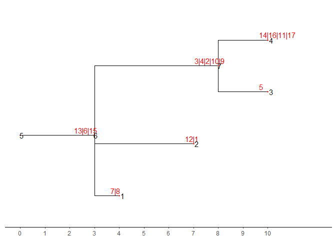

```{r, include = FALSE}
knitr::opts_chunk$set(
  collapse = TRUE,
  comment = "#>"
)
```

```{r setup}
library(converTree)
suppressMessages(library(ggtree))
suppressMessages(library(treeio))
library(gridExtra)
```

Every mutation tree from infSCITE is formatted as parent Vector in sample file. For example:

```{r}
pvtre <- "11 2 3 14 14 16 8 6 9 1 15 8 10 14 5 13 17"
```

We can reformat it to nwk that is a format easy to be visualization.

```{r}
# reformat
reformatParentVector <- function(pvtre) {
  
  lapply((strsplit(pvtre,"[ ]",)), function(x){
    as.integer(x)
  }) |> unlist()
  
}
pvtre1 = reformatParentVector(pvtre)
# convert to nwk
nwk_text <- parentVector2nwk(pvtre1,17)
nwk_text
```

Plot a mutation tree. In order to clearly display the structure of the tree. Red points and red numbers represent a mutation node (label in table). Black numbers mean the order of node in tree, from leaves to internal nodes (parent and node in table).

```{r, fig.align='center', fig.height=6, fig.fullwidth=TRUE, fig.cap='Mutation Tree'}
tre <- treeio::read.newick(text = nwk_text)
mtr <- ggtree(tre) + 
  geom_nodepoint(size = 1,color = "red",shape = 20) +
  geom_nodelab(color = "red",nudge_y = 0.1)+
  geom_nodelab(aes(label = node))+
  geom_tippoint(size = 1,color = "red",shape = 20)+
  geom_tiplab(color = "red",nudge_y = 0.1)+
  geom_tiplab(aes(label = node))
tre_dat <- tre %>% as_tibble()
tre_table <- gridExtra::tableGrob(tre_dat, theme = ttheme_minimal())
gridExtra::grid.arrange(tre_table, mtr, nrow = 1,widths = c(1,2))
```

{width="100%"}

Root, leaf and internal nodes will be kept and recode and all node in branch will move to the nearest node.

For example, node 6 and 7 with label 13 and 16 will move to node 8 and node 8 will re-code to 6 for root is 5 and re-label with 13,6,15. More addition, branch length will be changed according to mutation number.



stack_mutationTree() can be used to complete the transform of re-code and re-label.

```{r}
stre <- stack_mutationTree(tre)
```

Lets check what happened.

```{r}
mtrs <- ggtree(stre)+
  geom_nodepoint(size = 1,color = "red",shape = 20) +
  geom_nodelab(color = "red",nudge_y = 0.1,nudge_x = -0.4)+
  geom_nodelab(aes(label = node))+
  geom_tippoint(size = 1,color = "red",shape = 20)+
  geom_tiplab(color = "red",nudge_y = 0.1,nudge_x = -0.4)+
  geom_tiplab(aes(label = node))+
  theme_tree2()+
  scale_x_continuous(breaks = c(0:10), limits = c(0,12))
tre_dats <- stre %>% as_tibble()
tre_tables <- gridExtra::tableGrob(tre_dats, theme = ttheme_minimal())
gridExtra::grid.arrange(tre_tables, mtrs, nrow = 2)
```
